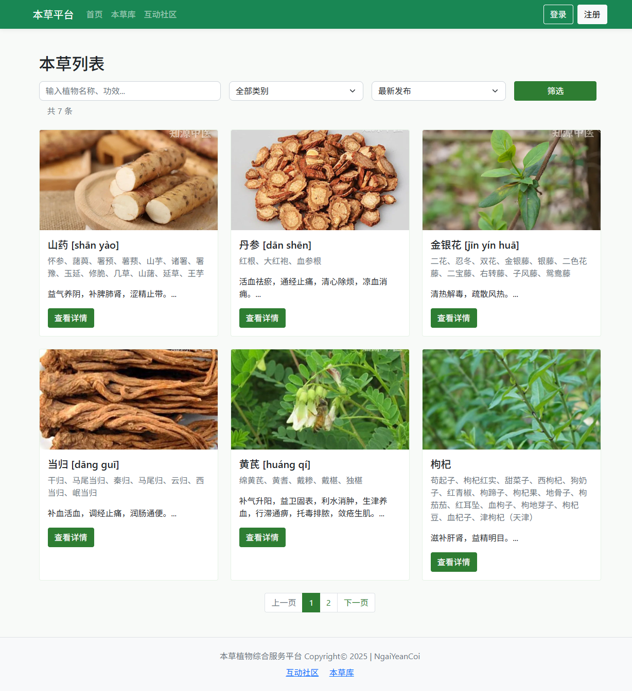
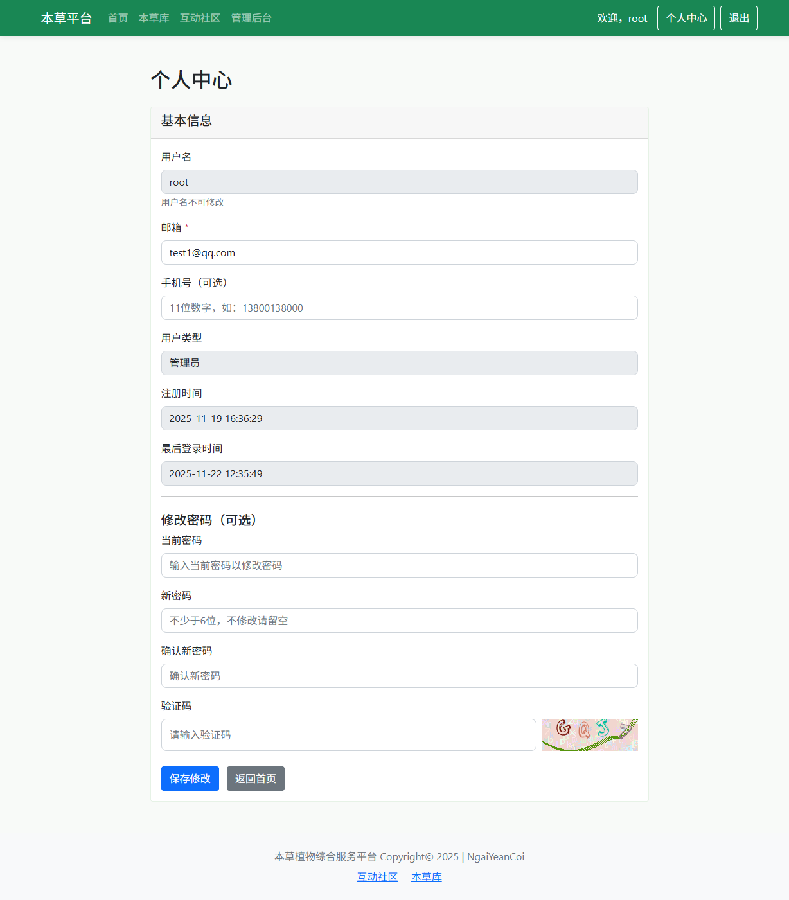
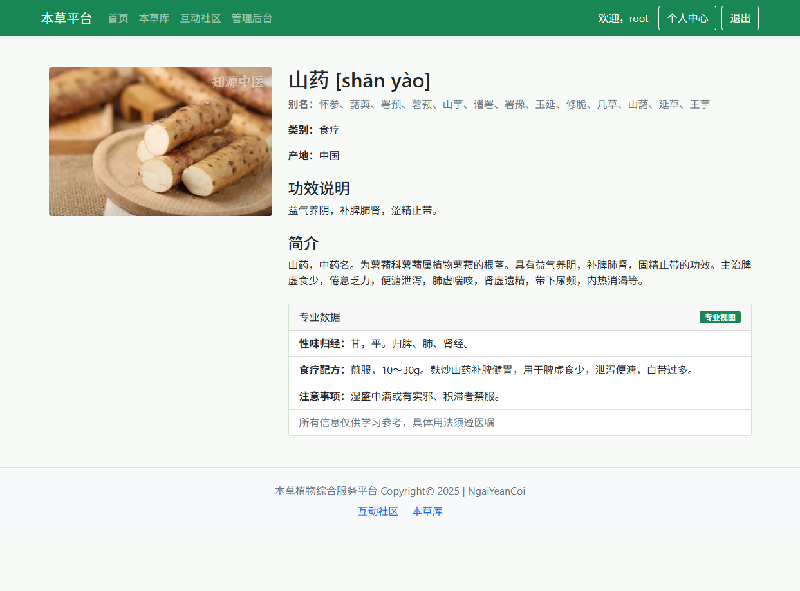
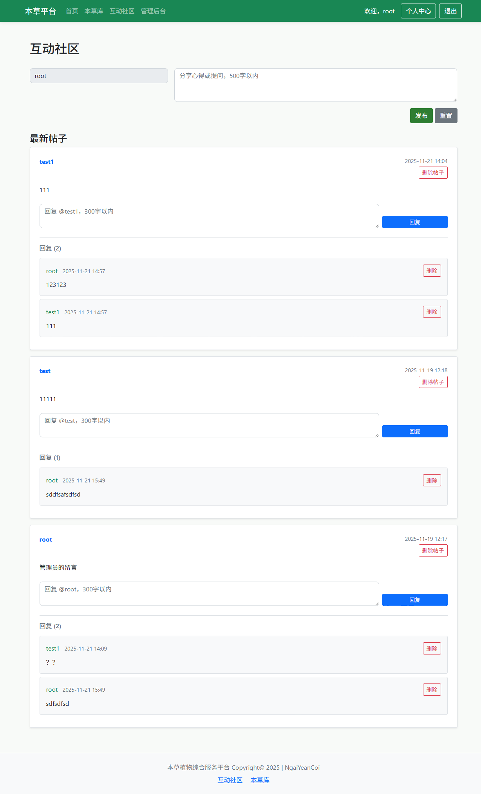

# 本草平台 (Herbal Platform)
一个专注于中医药本草知识展示与交流的平台，包含本草信息查询、用户管理、分类浏览等功能，传播中医药文化与知识。
## 项目功能
- 本草信息展示：提供本草植物的详细介绍、功效、产地等信息
- 用户系统：支持注册、登录、个人信息管理，区分普通用户、专业学习者、医生和管理员角色
- 分类浏览：按药用、食疗、观赏等类别筛选本草
- 搜索功能：快速查找所需本草信息
- 管理员后台：管理用户账号及权限
- 验证码安全机制：登录、注册、个人信息修改时的验证码验证
## 效果
### index.php

### login.php

### herb_list.php

### user_profile.php

### herb_detail.php

### community.php

## 环境要求
- PHP 7.4+
- MySQL 5.7+
- Composer（用于依赖管理）
- 浏览器（如 Chrome、Firefox、Safari 等）
## 安装步骤
1. 克隆仓库
   ```bash
   git clone https://github.com/NgaiYeanCoi/herbal_platform.git
   ```
   
2. 安装依赖
   ```bash
   # 先安装依赖可以参考https://www.runoob.com/w3cnote/composer-install-and-usage.html
   # 参考验证码依赖https://github.com/lifei6671/php-captcha
   cd herbal_platform
   composer install
   ```
   
3. 配置数据库
  - 1. 在项目根目录下的 `config.php` 文件中配置数据库连接信息
    ```php
    $host = 'localhost';       // 数据库主机
    $dbname = 'herbal_platform'; // 数据库名（需提前创建）
    $username = 'root';        // 数据库用户名
    $password = '10086';       // 数据库密码（替换为你的实际密码）
    ```
   - 2. 数据库表会自动创建：
      - 用户表 users 在首次访问 register.php 时自动创建
  
4. 新建数据库
   - 在 MySQL 中新建一个数据库，`herbal_platform`、用户表 `users`、本草表 `herbs`
        ```sql
        -- 创建数据库并设置字符集
        CREATE DATABASE IF NOT EXISTS herbal_platform DEFAULT CHARACTER SET utf8mb4 COLLATE utf8mb4_unicode_ci;
        USE herbal_platform;
        CREATE TABLE IF NOT EXISTS `users` (
                                            `id` int(11) NOT NULL AUTO_INCREMENT COMMENT '用户ID',
                                            `username` varchar(50) NOT NULL COMMENT '用户名（唯一）',
                                            `password` varchar(255) NOT NULL COMMENT '密码（加密存储）',
                                            `email` varchar(100) NOT NULL COMMENT '邮箱（唯一）',
                                            `phone` varchar(20) DEFAULT NULL COMMENT '手机号',
                                            `user_type` enum('ordinary','professional','doctor','admin') DEFAULT 'ordinary' COMMENT '用户类型',
                                            `avatar` varchar(500) DEFAULT '' COMMENT '头像URL',
                                            `created_at` datetime DEFAULT CURRENT_TIMESTAMP COMMENT '注册时间',
                                            `updated_at` datetime DEFAULT CURRENT_TIMESTAMP ON UPDATE CURRENT_TIMESTAMP COMMENT '更新时间',
                                            `last_login` datetime DEFAULT NULL COMMENT '最后登录时间',
                                            PRIMARY KEY (`id`),
                                            UNIQUE KEY `uk_username` (`username`),
                                            UNIQUE KEY `uk_email` (`email`),
                                            KEY `idx_user_type` (`user_type`)
        ) ENGINE=InnoDB DEFAULT CHARSET=utf8mb4 COMMENT='用户信息表';
        CREATE TABLE IF NOT EXISTS `herbs` (
                                            `id` int(11) NOT NULL AUTO_INCREMENT COMMENT '本草ID',
                                            `name` varchar(100) NOT NULL COMMENT '本草名称',
                                            `alias` varchar(200) DEFAULT '' COMMENT '别名',
                                            `category` varchar(50) NOT NULL COMMENT '类别（药用/食疗/观赏）',
                                            `origin` varchar(200) DEFAULT '' COMMENT '产地',
                                            `effect` text COMMENT '功效说明',
                                            `description` text COMMENT '简介',
                                            `food_recipe` text COMMENT '食疗配方（专业数据）',
                                            `property` varchar(200) DEFAULT '' COMMENT '性味归经（专业数据）',
                                            `attention` text COMMENT '注意事项（专业数据）',
                                            `image_url` varchar(500) DEFAULT '' COMMENT '图片URL',
                                            `create_time` datetime DEFAULT CURRENT_TIMESTAMP COMMENT '创建时间',
                                            PRIMARY KEY (`id`),
                                            KEY `idx_category` (`category`),
                                            KEY `idx_name` (`name`)
        ) ENGINE=InnoDB DEFAULT CHARSET=utf8mb4 COMMENT='本草植物信息表';
        ```
    1. 配置管理员账户
       1. 在网页按照提示注册一个用户
       2. 在 `users` 表中修改一条记录，将 `user_type` 设置为 `admin`，即可创建管理员账户
## 主要文件说明
- index.php：首页，展示本草推荐、分类导航
- login.php/register.php：用户登录与注册
- admin.php：管理员后台，管理用户信息
- herb_list.php：本草列表页，支持分类与搜索
- herb_detail.php：本草详情页，展示详细信息
- captcha.php：验证码生成逻辑，依赖 lifei6671/php-captcha
- config.php：数据库配置文件
- logout.php：退出登录
- user_profile.php：用户个人信息页
- herb_edit.php：本草信息编辑页（管理员）
- community.php：用户社区
- base.php：基础布局文件，包含导航栏、页脚等

# 许可证
本项目基于 MIT 许可证开源，你可以在遵守许可证条款的前提下自由使用、修改和分发本项目的代码。
